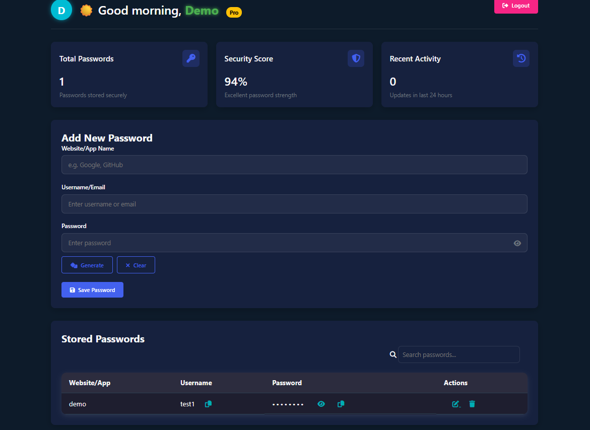

<div align="center">

# 🔐 Password Manager System  
**Secure, Local, and Simple Password Storage**

A local password manager built with Python Flask that securely hashes your credentials, backs them up, and gives you full control via a modern web dashboard.


</div>

---

<p align="center">
  <!-- Language & Framework -->
  
  
  

  <!-- Database -->
  
  

  <!-- Security & Encryption -->
  
  
  

  <!-- Frontend -->
  
  
  
  

  <!-- Libraries -->
  
  
  
  

  <!-- Environment -->
  
  
  
</p>


---

## 📜 Overview

The **Password Manager System** is a secure, locally-hosted web app that lets users register, log in, and manage their credentials in one place. Passwords are **hashed**, not stored in plain text, and users can **add**, **edit**, **delete**, and **copy** them from a beautiful dashboard. All actions are logged, and a JSON **backup** is automatically created for added reliability.

---

## 🌟 Features

- 🔐 **User Registration & Login**  
- 🧠 **Unique User ID System**
- 🧾 **Hashed Password Storage (SHA256)**
- 💾 **Automatic Backup File (JSON)**
- 🛡️ **Secure Deletion with Re-Authentication**
- 📊 **Password Count, Audit Log, and Dashboard**
- ✂️ **Copy, Edit, and Delete Stored Passwords**

---

## 📂 Project Flow

```mermaid
graph TD
    A[Visit App] --> B{Is User Registered?}
    B -- Yes --> C[Login]
    B -- No --> D[Register]
    D --> E[Generate Unique User ID]
    C --> F[Fetch User ID from MySQL]
    F --> G[Display Dashboard]

    G --> H[View Passwords]
    G --> I[Add New Password]
    G --> J[Edit/Copy/Delete]

    I --> K[Hash + Store in DB]
    K --> L[Update Xlsx Backup & Logs]

    J --> M{User Verified?}
    M -- Yes --> N[Delete/Edit Action]
    N --> L
````

---

## 🧰 Tech Stack

| Layer            | Tech/Tool                                                                                                                                                                                                                                                 |
| ---------------- | --------------------------------------------------------------------------------------------------------------------------------------------------------------------------------------------------------------------------------------------------------- |
| Backend          |  Python,  Flask                                                                                                                                     |
| Frontend         |  HTML,  CSS,  JS,  Bootstrap |
| Database         |  MySQL                                                                                                                                                                                       |
| Logging & Backup | Local `logs/`, `backup/passwords.json`                                                                                                                                                                                                                    |

---

## 📸 Dashboard Preview

<p align="center">
  
</p>

---

## 📁 File Structure

```
password-manager-system/
│
├── static/                 # CSS, JS files
├── templates/              # Flask HTML templates
├── password_backup.xlsx    # Auto-generated xlsx backups
├── password_manager.log    # Logs of user activity
├── app.py                  # Main Flask app
├── requirements.txt        # Python dependencies
└── README.md
```

---

## 🧪 How to Run Locally

### ✅ Prerequisites

* Python 3.8+
* MySQL Server
* pip (`pip install -r requirements.txt`)

### ⚙️ Setup

```bash
# Clone the repo
git clone https://github.com/yourusername/password-manager-system.git
cd password-manager-system

# Create virtual environment (optional)
python -m venv venv
source venv/bin/activate  # Windows: venv\Scripts\activate

# Install dependencies
pip install -r requirements.txt
```

# 🔧 Configure Database

1. ### Open MySQL
2. ### Create database:

   ```sql
   CREATE DATABASE password_manager;
   ```
3. #### 🔐 `users` Table

```sql
CREATE TABLE users (
  id CHAR(36) NOT NULL PRIMARY KEY,
  username VARCHAR(255) NOT NULL UNIQUE,
  password_hash VARCHAR(255) NOT NULL,
  created_at TIMESTAMP DEFAULT CURRENT_TIMESTAMP
);
```

| Field           | Type           | Key         | Description            |
| --------------- | -------------- | ----------- | ---------------------- |
| `id`            | `char(36)`     | Primary Key | UUID for each user     |
| `username`      | `varchar(255)` | Unique      | Unique username        |
| `password_hash` | `varchar(255)` |             | SHA256 hashed password |
| `created_at`    | `timestamp`    |             | Account creation time  |

---

4. #### 🔑 `passwords` Table

```sql
CREATE TABLE passwords (
  id INT NOT NULL AUTO_INCREMENT PRIMARY KEY,
  salt VARCHAR(255) NOT NULL,
  username VARCHAR(255) NOT NULL,
  password_hash TEXT NOT NULL,
  created_at TIMESTAMP DEFAULT CURRENT_TIMESTAMP,
  user_id CHAR(36),
  FOREIGN KEY (user_id) REFERENCES users(id)
);
```

| Field           | Type           | Key         | Description                                 |
| --------------- | -------------- | ----------- | ------------------------------------------- |
| `id`            | `int`          | Primary Key | Auto-incremented ID for each password entry |
| `salt`          | `varchar(255)` |             | Salt used in AES encryption                 |
| `username`      | `varchar(255)` |             | Username of the app/site account            |
| `password_hash` | `text`         |             | Encrypted (hashed + AES) password           |
| `created_at`    | `timestamp`    |             | Entry creation time                         |
| `user_id`       | `char(36)`     | Foreign Key | Links to the `users` table via `users.id`   |

---

### 🔄 Relationships

```text
users.id (char[36])  ←──  passwords.user_id (char[36])
[1 User] → [Many Passwords]
```


### 🚀 Run the App

```bash
python app.py
```

Visit: `http://localhost:5000`

---

## 🔐 Security Notes

* All passwords are **SHA256 hashed**
* User authentication required for all operations
* **Deletion is double-verified**
* Regular **logs and JSON backups** maintained locally

---

## 🚀 Future Roadmap

* [ ] 🔑 Export encrypted vault
* [ ] 📲 Mobile-friendly UI
* [ ] 🔒 Add 2FA/MFA login option
* [ ] 📊 Insights: weak vs strong password detection

---

## 👨‍💻 Author

Made with 🖤 by [**Shivam Prasad**](https://github.com/shivamprasad1001)
🔗 Connect: [LinkedIn](https://www.linkedin.com/in/shivamprasad1001)

---

## 📝 License

This project is licensed under the [MIT License](LICENSE).

---

> ⭐ Star the repo if you like it. Pull requests and feedback welcome!
